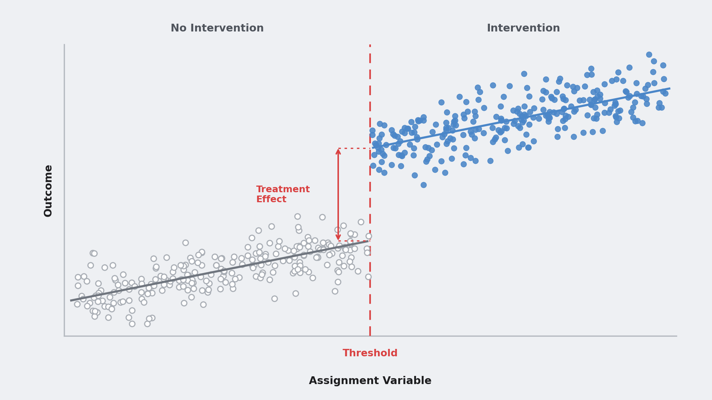
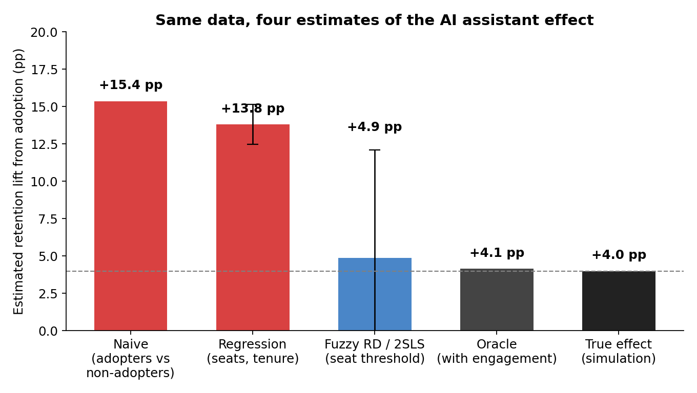

# Your AI Adoption Lift Is a Selection Effect

[](https://colab.research.google.com/github/williamgieng/ai-adoption-selection-effect/blob/main/notebooks/ai_adoption_selection_effect.ipynb)

Companion code for the Towards Data Science article *Your AI Adoption Lift Is a Selection Effect*: a practitioner's guide to estimating what an opt-in AI feature actually did, when nobody randomized it.



## The problem

Somewhere in your company there is a slide that says customers who enabled the AI assistant retain 15 points better than customers who did not. Nobody randomized the assistant. It shipped to eligible accounts, some of them turned it on, and the comparison is between the accounts that chose it and the accounts that did not.

That is a description of who opts in, not an effect. The fix in the article is not to model the customer's choice harder. It is to find variation the customers did not choose: the eligibility threshold that gated the feature.

## What is here

| Path | What it is |
|---|---|
| `notebooks/ai_adoption_selection_effect.ipynb` | End-to-end walkthrough. Simulation, naive and adjusted estimates, fuzzy RD by 2SLS, diagnostics, both figures. Runs in Colab. |
| `src/simulate.py` | The data-generating process and estimators as importable functions. `python -m src.simulate` prints every number cited in the article. |
| `src/make_figures.py` | Regenerates the article figures. `python -m src.make_figures` |
| `figures/` | Figure 1 (four estimates), Figure 2 (the discontinuity), and the hero image. |

## Results

Synthetic data: 40,000 B2B accounts, an AI assistant gated at 25 seats, voluntary adoption among eligible accounts, and a latent engagement variable that drives both adoption and retention. The true effect of adoption is +4 pp of 6-month retention.

| Estimate | Value | What it is |
|---|---|---|
| Naive adopter gap | +15.4 pp | Ready vs. unready organizations, with a feature flag |
| Regression-adjusted | +13.8 pp | Same thing, holding seats and tenure fixed |
| RD reduced form at 25 seats | +1.8 pp (−0.9 to +4.5) | Effect of offering access at the eligibility margin |
| RD 2SLS at 25 seats | +4.9 pp (−2.4 to +12.1) | Effect of adoption for accounts induced to adopt by eligibility |
| True effect | +4.0 pp | |



The naive and adjusted estimates are precise and wrong. The RD estimate is imprecise and centered on the truth. The interval is wide because the identifying variation is thin: a 4-point effect diluted through a 37% first stage is a 1.5-point jump in the raw outcome. That is the price of throwing away the variation created by customer choice.

## Running locally

```bash
pip install -r requirements.txt
python -m src.simulate        # all numbers
python -m src.make_figures    # both figures into figures/
```

Or open the notebook in Colab with the badge above.

## Diagnostics covered

Bandwidth sensitivity, the discrete running variable (and why clustering by seat count is not a free fix), placebo cutoffs whose windows do not cross the real one, covariate smoothness, co-interventions at the threshold, and density of the running variable around the cutoff.

## References

- Lee, D. S. and Card, D. (2008). Regression discontinuity inference with specification error. *Journal of Econometrics*.
- Kolesár, M. and Rothe, C. (2018). Inference in regression discontinuity designs with a discrete running variable. *American Economic Review*.

## License

MIT. Code and figures are free to reuse with attribution.
